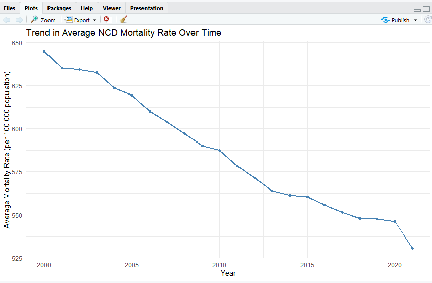

NCD Global Mortality Rate Analysis

Overview

This project analyzes global age-standardized non-communicable disease (NCD) mortality rates using WHO data. It demonstrates an end-to-end healthcare data analytics workflow, including data cleaning, SQL analysis, statistical visualization, and interactive dashboard development.

 Key Visualization

The chart below illustrates the overall global trend in age-standardized NCD mortality rates (per 100,000 population) over the study period, providing a high-level overview of the project's primary analytical findings.

Objectives

* Clean and prepare the dataset.
* Analyze mortality trends across countries, regions, sex, and time.
* Answer analytical questions using SQL.
* Create statistical visualizations in R.
* Build interactive Power BI dashboards.

Dataset

* Source: World Health Organization (WHO)
* Indicator: Age-standardized NCD mortality rate (per 100,000 population)
* Format: CSV

Tools Used

* Excel – Data cleaning and quality checks
* SQL – Data exploration and querying
* R – Statistical analysis and visualization
* Power BI – Interactive dashboards

   📂 Project Structure

- 📁 [a_data](./a_data/) – Dataset overview and preview.
- 📁 [b_excel](./b_excel/) – Data  quality assessment.
- 📁 [c_sql_queries](./c_sql_queries/) – SQL scripts used for data exploration and analysis.
- 📁 [c_sql_queries_results](./c_sql_queries_results/) – SQL outputs, descriptions, and findings.
- 📁 [d_r_scripts](./d_r_scripts/) – R scripts for statistical analysis and visualization.
- 📁 [d_r_scripts_results](./d_r_scripts_results/) – R outputs, visualizations, and interpretations.
- 📁 [e_powerbi](./e_powerbi/) – Power BI dashboard image and documentation.

  .gitignore

  LICENSE

 Key Insights

- NCD mortality rates exhibit distinct regional patterns across WHO regions.
- Mortality trends vary over time, highlighting changes in the global burden of non-communicable diseases.
- Statistical analysis identified significant differences in mortality rates between regions.
- SQL analysis identified countries with mortality rates exceeding their respective regional averages, supporting targeted regional comparisons.

Skills Demonstrated

Excel • SQL • R • Power BI • Data Cleaning • Data Visualization • Exploratory Data Analysis • Healthcare Analytics

