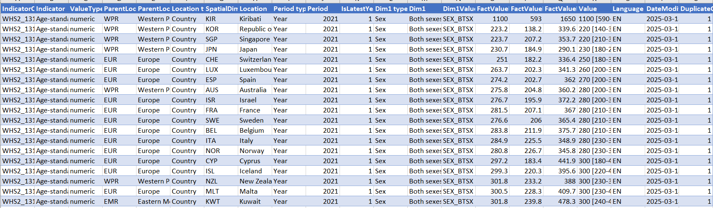

# Data

This folder contains the dataset used for the **NCD Global Mortality Rate Analysis** project.

## Dataset Information

 Source: World Health Organization (WHO).
 
 Indicator: Age-standardized NCD mortality rate (per 100,000 population).
 
 Format: Excel.
 
 Coverage: Global country-level mortality data.

 Data preview link. The image shows the first 20 rows of the dataset used in this project. 

The dataset was used for data cleaning in Excel, exploratory analysis in SQL, statistical analysis and visualization in R, and dashboard development in Power BI.

