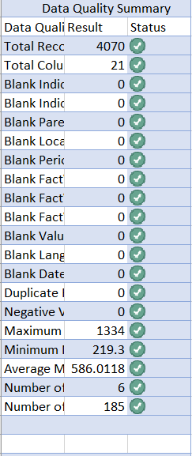

Data quality check.
Description

Summarizes the results of the data quality assessment by checking dataset completeness, consistency, duplicate records, and key descriptive metrics to ensure the data is suitable for analysis.

Findings

The quality assessment indicates that the dataset is complete and free from major data quality issues, providing a reliable foundation for subsequent analysis and visualization.

