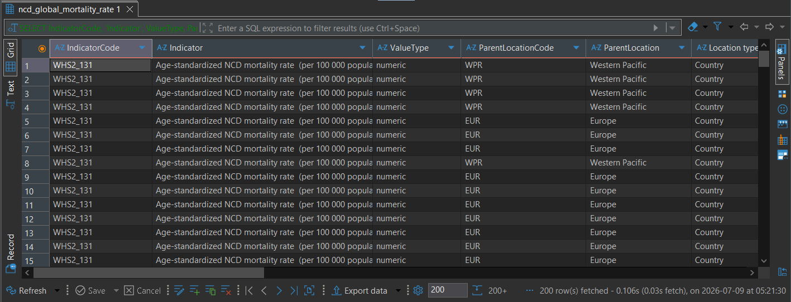
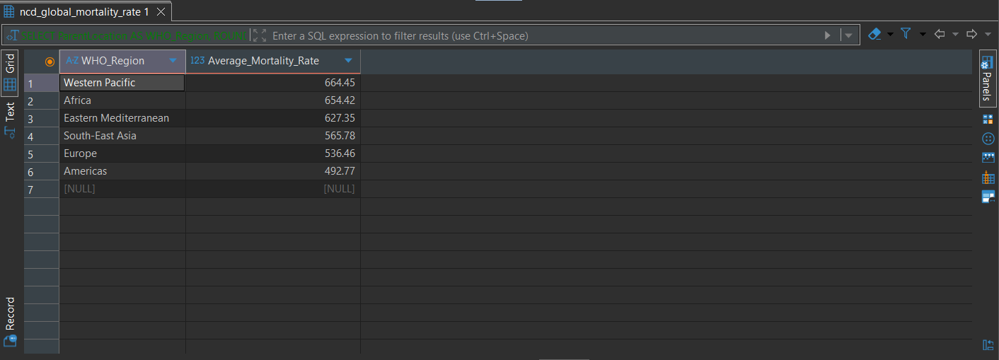
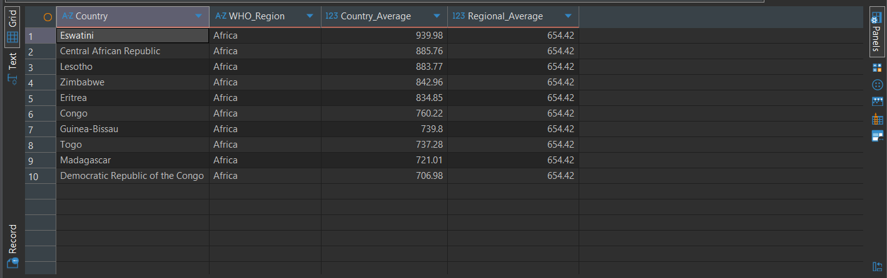

Query 1: Data Preview

Findings:
The dataset loaded successfully, and all required variables were available for subsequent cleaning and analysis.

Query 2: Average Mortality Rate by WHO Region

Findings:
The query highlighted differences in average age-standardized NCD mortality rates across WHO regions, providing a basis for regional comparisons.

Query 3: Countries Above Their Regional Average

Findings:
Several countries were identified with mortality rates above their respective regional averages, enabling the identification of countries with relatively higher NCD mortality burdens within each region.
