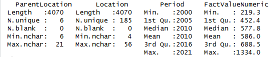
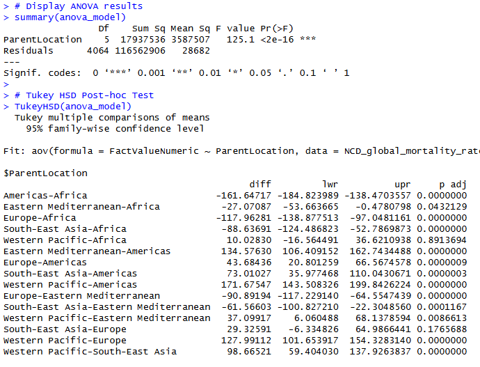

Script 1: Summary statistics.
Description

Summarizes the structure and distribution of the dataset variables to assess data completeness and understand the characteristics of the mortality rate before conducting further statistical analyses.

Findings

The summary indicates that the dataset is suitable for analysis and provides evidence of variability in NCD mortality rates, supporting the need for comparative and trend analyses across countries, regions, and years.

Script 2: Trend in Average NCD Mortality Rate Over Time
Description

Calculates the annual average age-standardized NCD mortality rate and visualizes how it changes over time using a line chart.

Findings

The visualization shows a consistent decline in average NCD mortality rates across the study period, highlighting changes in mortality patterns over time.

Script 3: ANOVA and Tukey HSD Test
Description

Performs a one-way ANOVA to assess differences in average NCD mortality rates across WHO regions, followed by a Tukey HSD post-hoc test to identify which regional pairs differ significantly.

Findings

The analysis found statistically significant differences in mortality rates between WHO regions. The Tukey HSD test further identified the specific regional comparisons responsible for these differences.

